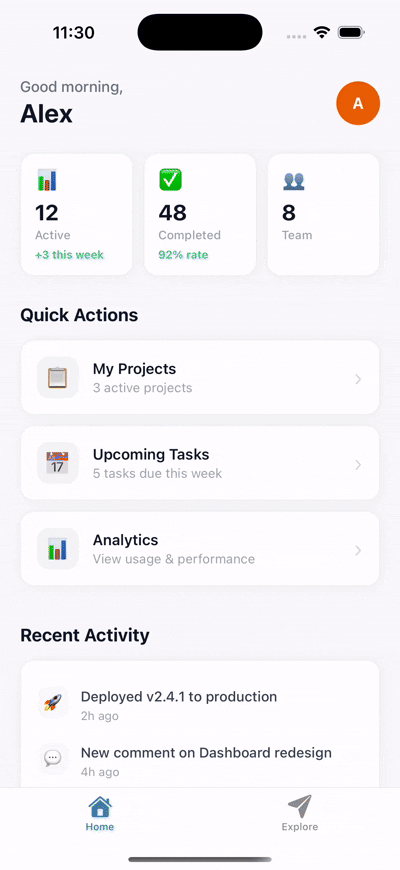

<p align="center">
  
</p>

<h1 align="center">@featuredeck/react-native</h1>

<p align="center">
  Beautiful in-app feedback SDK for React Native — feature requests, upvotes & roadmap.
</p>

<p align="center">
  <a href="https://www.npmjs.com/package/@featuredeck/react-native"></a>
  <a href="https://www.npmjs.com/package/@featuredeck/react-native"></a>
  <a href="https://github.com/Mak-3/featuredeck-react-native/blob/main/LICENSE"></a>
</p>

---

<p align="center">
  
</p>

---

## Features

- **Feature Requests** — Let users browse, submit, and upvote feature ideas
- **Roadmap** — Show planned, in-progress, and completed items
- **Optimistic UI** — Instant feedback on votes and submissions
- **Theming** — Fully customizable colors, dark mode support
- **Zero config UI** — Drop-in full-screen modal with two tabs
- **Pull-to-refresh & infinite scroll** built in

## Requirements

- React Native 0.68+
- React 17+
- Expo supported
- iOS and Android

## Installation

```bash
# npm
npm install @featuredeck/react-native

# yarn
yarn add @featuredeck/react-native

# pnpm
pnpm add @featuredeck/react-native
```

### Peer Dependency

FeatureDeck uses [zustand](https://github.com/pmndrs/zustand) for internal state management. If your project doesn't already include it:

```bash
npm install zustand
```

## Quick Start

### 1. Initialize the SDK

Call `init` in your app entry point (e.g. `App.tsx`). Get your API key from the [FeatureDeck dashboard](https://featuredeck.in).

```tsx
import { FeatureDeck } from '@featuredeck/react-native';

await FeatureDeck.init({
  apiKey: 'your-api-key',
});

await FeatureDeck.setUser({
  externalUserId: 'user-123',
  username: 'johndoe',
  email: 'john@example.com',
});
```

### 2. Wrap Your App with the Provider

Add `FeatureDeckProvider` at your app root. This renders the feedback board modal.

```tsx
import { FeatureDeckProvider } from '@featuredeck/react-native';

export default function App() {
  return (
    <FeatureDeckProvider>
      {/* Your app content */}
    </FeatureDeckProvider>
  );
}
```

### 3. Open the Feature Board

Trigger the board from anywhere — a button, menu item, or settings screen.

```tsx
import { FeatureDeck } from '@featuredeck/react-native';

function SettingsScreen() {
  return (
    <View>
      <TouchableOpacity onPress={() => FeatureDeck.openFeatureBoard()}>
        <Text>Feature Requests</Text>
      </TouchableOpacity>
    </View>
  );
}
```

## What's Included

The SDK opens a full-screen modal with two tabs:

| Features Tab | Roadmap Tab |
|---|---|
| Browse all feature requests | View planned, in-progress & completed items |
| Upvote features with optimistic UI | Grouped by status with clear labels |
| Submit new feature requests | Pull-to-refresh for latest updates |
| Delete features you created | |
| Pull-to-refresh & infinite scroll | |

## User Management

Users must be identified to submit features, vote, and delete their own requests.

```tsx
// When user logs in
await FeatureDeck.setUser({
  externalUserId: 'user-123',  // Required — your app's user ID
  username: 'johndoe',         // Optional
  email: 'john@example.com',   // Optional
});

// When user logs out
await FeatureDeck.setUser(null);
```

## Customization

### Theme

Customize colors to match your app's design. Pass a theme during initialization or update it later.

```tsx
await FeatureDeck.init({
  apiKey: 'your-api-key',
  theme: {
    colors: {
      primary: '#8B5CF6',
      background: '#FFFFFF',
      text: '#1F2937',
    },
    isDark: false,
  },
});

// Update theme at runtime
FeatureDeck.setTheme({
  colors: {
    primary: '#10B981',
  },
  isDark: true,
});

// Quick dark/light mode toggles
FeatureDeck.enableDarkMode();
FeatureDeck.enableLightMode();
```

### Theme Utilities

Create themes from a single color or merge with defaults.

```tsx
import {
  createThemeFromColor,
  mergeTheme,
  lightTheme,
  darkTheme,
} from '@featuredeck/react-native';

const customTheme = createThemeFromColor('#E85D04', false);
const merged = mergeTheme(lightTheme, customTheme);

await FeatureDeck.init({
  apiKey: 'your-api-key',
  theme: merged,
});
```

## API Reference

### `FeatureDeck.init(config)`

Initialize the SDK. Must be called before any other method.

```tsx
FeatureDeck.init(config: FeatureDeckConfig): Promise<void>

interface FeatureDeckConfig {
  apiKey: string;
  theme?: Partial<Theme>;
}
```

### `FeatureDeck.setUser(user)`

Identify the current end user. Required for voting, creating, and deleting features.

```tsx
FeatureDeck.setUser(user: UserInput | null): Promise<void>

interface UserInput {
  externalUserId: string;  // Required
  username?: string;
  email?: string;
}
```

### `FeatureDeck.openFeatureBoard()`

Open the feature board modal with Features and Roadmap tabs.

```tsx
FeatureDeck.openFeatureBoard(): void
```

### `FeatureDeck.close()`

Programmatically close the modal.

```tsx
FeatureDeck.close(): void
```

### `FeatureDeck.setTheme(theme)`

Update the theme at runtime.

```tsx
FeatureDeck.setTheme(theme: Partial<Theme>): void
FeatureDeck.enableDarkMode(): void
FeatureDeck.enableLightMode(): void
```

### Utility Methods

```tsx
FeatureDeck.isReady(): boolean     // Has init() completed?
FeatureDeck.isVisible(): boolean   // Is the modal currently open?
FeatureDeck.getUser(): User | null // Get the current user
```

## Full Example

```tsx
import React, { useEffect } from 'react';
import { View, Text, TouchableOpacity, StyleSheet } from 'react-native';
import {
  FeatureDeck,
  FeatureDeckProvider,
} from '@featuredeck/react-native';

async function bootstrap() {
  await FeatureDeck.init({ apiKey: 'your-api-key' });

  await FeatureDeck.setUser({
    externalUserId: 'user-123',
    username: 'johndoe',
    email: 'john@example.com',
  });
}

export default function App() {
  useEffect(() => {
    bootstrap();
  }, []);

  return (
    <FeatureDeckProvider>
      <View style={styles.container}>
        <Text style={styles.title}>My App</Text>
        <TouchableOpacity
          style={styles.button}
          onPress={() => FeatureDeck.openFeatureBoard()}
        >
          <Text style={styles.buttonText}>Feature Requests</Text>
        </TouchableOpacity>
      </View>
    </FeatureDeckProvider>
  );
}

const styles = StyleSheet.create({
  container: { flex: 1, justifyContent: 'center', alignItems: 'center' },
  title: { fontSize: 24, fontWeight: '700', marginBottom: 24 },
  button: {
    backgroundColor: '#111',
    paddingVertical: 14,
    paddingHorizontal: 28,
    borderRadius: 10,
  },
  buttonText: { color: '#fff', fontSize: 16, fontWeight: '600' },
});
```

## Getting Your API Key

1. Sign up and create a project at [featuredeck.in](https://featuredeck.in)
2. Navigate to your project settings
3. Copy the API key and pass it to `FeatureDeck.init()`

## Need Help?

- Email: [featuredeck.support@gmail.com](mailto:featuredeck.support@gmail.com)
- GitHub: [github.com/Mak-3/featuredeck-react-native](https://github.com/Mak-3/featuredeck-react-native)
- Check out the example app in the repository

## License

MIT
